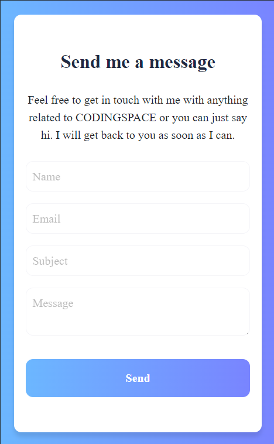
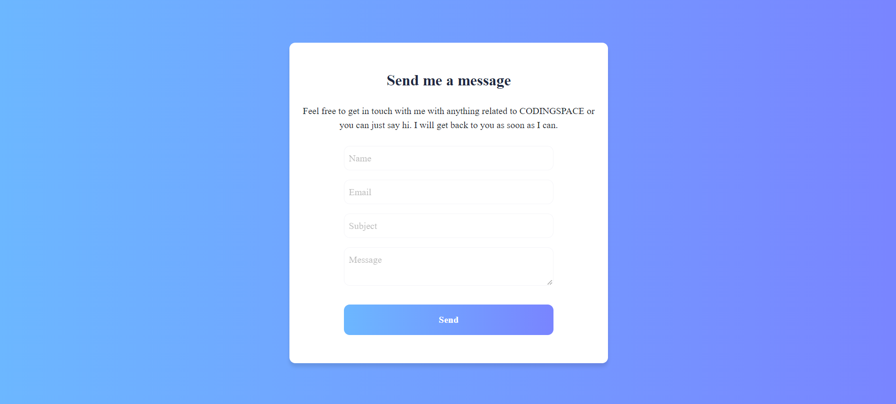

# contact-us-form

This project is a solution for the [Contact us from challenge from FrontendPro](https://www.frontendpro.dev/frontend-coding-challenges/contact-us-form-uE4XYJicVTKtJp7FS4HX). The contact form was developed using  HTML, CSS, Sass, Bootstrap, JavaScript, and React. It features a fully responsive design compatible with various devices, following the provided Figma designs for [Mobile](https://www.figma.com/design/0T5eX1C9aj3cHz6oBlNH1b/Contact-Form?node-id=20-3&t=Fz9rlsCz0bcztmR1-0) and [Desktop](https://www.figma.com/design/0T5eX1C9aj3cHz6oBlNH1b/Contact-Form?node-id=1-3&t=CQ4o8KmyCNeJS472-0).
The form submissions are handled by integrating the Web3Forms API, ensuring that responses are sent directly to the specified email.

## Table of contents

- [Overview](#overview)
    - [The challenge](#the-challenge)
    - [Requirements](#requirements)
    - [Screenshots](#screenshots)
- [Getting Started with Create React App](#getting-started-with-create-react-app)
    - [Available Scripts](#available-scripts)

## Overview

### The challenge
Create a functional and responsive Contact Us Form that allows users to connect with the website owner.

### Requirements
- All fields are required and must be validated.
- The email field must be validated to ensure it is a valid email address format.
- The form should display a success message to the user after the form is submitted.
- The form should also display an error message if there are any issues with the form submission, such as an invalid email address or missing fields.
- The form should be responsive and should adjust to different screen sizes.
- The form should use the Contact Form API to send a form submission response to the email inbox.
- Show the hover state of all the elements.
- The component should be responsive and display correctly on different screen sizes.
- Make this landing page look as close to the design as possible.

### Screenshots

# Getting Started with Create React App

This project was bootstrapped with [Create React App](https://github.com/facebook/create-react-app).

## Available Scripts

In the project directory, you can run:

### `npm start`

Runs the app in the development mode.\
Open [http://localhost:3000](http://localhost:3000) to view it in your browser.

The page will reload when you make changes.\
You may also see any lint errors in the console.

### `npm run build`

Builds the app for production to the `build` folder.\
It correctly bundles React in production mode and optimizes the build for the best performance.

The build is minified and the filenames include the hashes.\
Your app is ready to be deployed!

See the section about [deployment](https://facebook.github.io/create-react-app/docs/deployment) for more information.